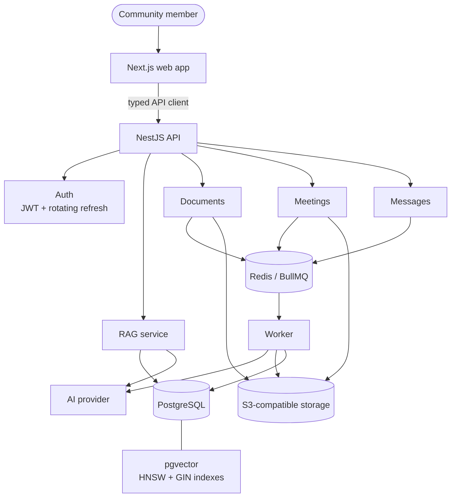
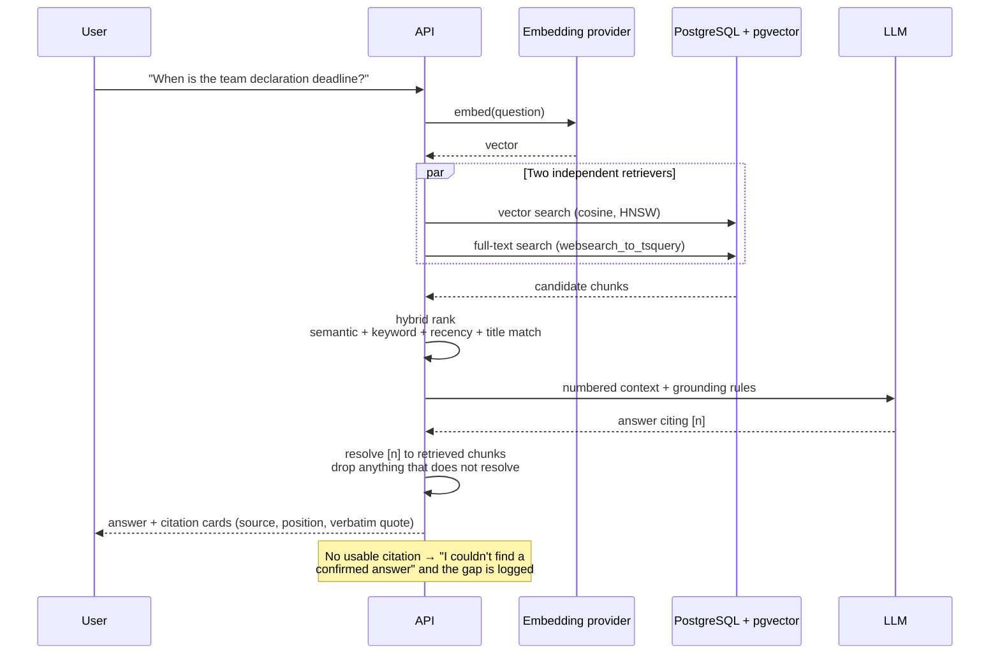
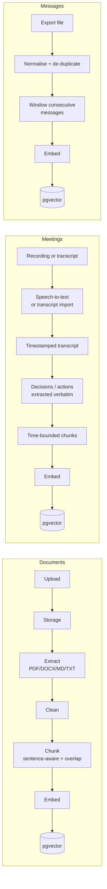

# UniPods Pulse

**Your community. One intelligent memory.**

UniPods Pulse turns the scattered record of a community — group chats, call
recordings, shared documents, announcements — into one searchable memory you can
ask questions of, where **every answer shows the source it came from**, and
where the system says *"I couldn't find a confirmed answer"* rather than
guessing.

---

## The problem

Community knowledge does not live in one place. The deadline is in an
announcement, the reason for it is in a call nobody re-watches, the exception to
it is three replies deep in a channel, and the document that supersedes all of
it was uploaded last week. So people ask the same questions over and over, and
the answers they get are whatever someone half-remembers.

Search does not fix this, because people do not remember the words that were
used. A general-purpose chatbot does not fix it either: it will answer
confidently about a deadline it has never seen.

## The solution

```
Scattered information  →  Unified knowledge  →  Search  →  AI understanding
                                                            ↓
                                        Grounded answer  ←  Source
```

UniPods Pulse ingests the community's own material, indexes it for both meaning
and exact wording, retrieves the passages that bear on a question, and answers
**only** from those passages — attaching a citation to the document page,
meeting timestamp or message each claim came from.

When retrieval turns up nothing that supports an answer, it says so and records
the question as an **information gap**, so administrators can see exactly what
their community has never written down.

---

## Features

| | |
|---|---|
| **Ask in plain language** | "When is the deadline?", "What did we decide?", "What did I miss today?" |
| **Answers with sources** | Every claim carries a citation to a page, timestamp or message, with a verbatim excerpt |
| **Honest refusals** | No supporting evidence means no answer — and the question is logged as a gap |
| **Conflict reporting** | When two sources disagree, both are shown, with the more recent one flagged as current |
| **Documents** | PDF, DOCX, Markdown and plain text, with page numbers and section headings preserved |
| **Meetings** | Upload a recording to transcribe, or import an existing VTT/SRT/JSON transcript; decisions, action items and deadlines are extracted verbatim with timestamps |
| **Messages** | Import Telegram exports, JSON, CSV or plain-text chat logs; consecutive messages are windowed so short lines stay retrievable |
| **What did I miss?** | A briefing for a day or a range, ranked by importance, every item linked to its source |
| **Global search** | The same hybrid retrieval the assistant uses, without the answering step |
| **Telegram bot** | Add it to the group: it reads along, and answers when asked, with the same citations and the same refusals as the web app |
| **Automation** | `POST /api/ingest/*` lets n8n (or anything else) feed messages in and ask questions, so the bot logic can live in a workflow instead of in code |
| **Admin** | Knowledge browser, processing status, queue depths, dependency health, and the ranked list of unanswered questions |

---

## Architecture



### How an answer is produced



### Ingestion



---

## Tech stack

| Layer | Choice | Why |
|---|---|---|
| Web | Next.js 16 (App Router), React 19, Tailwind 4, TanStack Query | Server-rendered shell, client-side data with caching and retries |
| API | NestJS 11, Prisma 7 | Module boundaries that match the domain; guards and pipes for security and validation in one place |
| Database | PostgreSQL 16 + **pgvector** | Vectors, full-text search and relational data in one store — no second system to keep in sync |
| Queue | Redis + BullMQ | Nothing expensive runs inside an HTTP request |
| AI | Provider interfaces + OpenAI-compatible adapter | Any OpenAI-compatible endpoint works; the provider is one file |
| Storage | S3-compatible (AWS S3, Cloudflare R2, DigitalOcean Spaces, MinIO) or local | Signed URLs only; nothing is ever served from a permanent public link |

### Repository layout

```
apps/
  web/        Next.js app
  api/        NestJS API
  worker/     BullMQ consumers
packages/
  ai/         Provider interfaces, OpenAI + offline providers, chunking, prompts
  config/     Zod-validated environment and shared constants
  database/   Prisma client, pgvector search, embedding writes
  ingest/     Framework-free pipelines and parsers, shared by API, worker and scripts
  types/      API contract types shared by server and browser
  ui/         Design-system primitives
prisma/       Schema, migrations, seed and demo content
docker/       Production Dockerfiles
docs/         Architecture, RAG, security and deployment notes
scripts/      RAG evaluation
```

`packages/ingest` exists so the API, the worker, the seed and the evaluation
script all run **the same ingestion code**. Without it, the pipeline would be
duplicated between the API and the worker and would drift.

---

## Local setup

**Requirements:** Node 20.11+, pnpm 10, Docker (for PostgreSQL and Redis).

```bash
git clone <this repository>
cd unipods-pulse
pnpm install

cp .env.example .env         # then edit it — see below
pnpm db:up                   # PostgreSQL (with pgvector) and Redis
pnpm db:generate             # generate the Prisma client
pnpm db:deploy               # create the schema
pnpm db:seed                 # optional: synthetic demo community

pnpm dev                     # web :3000, API :3001, worker
```

> **The database needs pgvector installed on the server.** The first migration
> runs `CREATE EXTENSION IF NOT EXISTS "vector"`, which only *enables* an
> extension the host already has — it cannot install one. `pnpm db:up` uses the
> `pgvector/pgvector:pg16` image, which has it. A stock PostgreSQL does not, and
> fails with `extension "vector" is not available`. See
> [Running without Docker](#running-without-docker) or
> [docs/supabase.md](docs/supabase.md).

Open <http://localhost:3000>. The **first account you register becomes the
administrator**; everyone after that is a regular member.

If you seeded the demo data, sign in with `admin@unipods.dev` /
`unipods-demo-2026` and set `DEMO_MODE=true` so that content is visible.

### If the web app will not start

Two failures account for almost all of them, and neither is a code problem.

**`Cannot find module for page: route not found /page`**, alongside
`ENOENT ... .next/dev/server/pages/_app/build-manifest.json`.

Almost always a stray **Pages Router directory**. This app is App Router only,
and `/page` is what Next calls a file named `page.tsx` sitting in a `pages/`
folder — while `_app` is a Pages Router entry point nothing here needs. One such
folder switches the Pages Router on and produces this, naming neither the folder
nor the cause. Because it is untracked, `git pull` will not remove it and
clearing `.next` does not help, so it survives every obvious remedy:

```bash
# from the repository root
rm -rf apps/web/pages apps/web/src/pages       # PowerShell: rmdir /s /q apps\web\pages
pnpm dev
```

`pnpm dev` now checks for this before starting and says so plainly if it finds
one, so the confusing version of the error should not reach you again.

If neither folder exists, the dev build is incomplete rather than
misconfigured. Start from a clean cache:

```bash
pnpm dev:clean          # deletes .next, then starts dev
```

If it still comes back, something outside the project is interfering with
`.next`.
Turbopack writes thousands of small files there, and two things on Windows
routinely eat them mid-write:

- **A synced folder.** `Desktop`, `Documents` and `OneDrive` are synced by
  default on most Windows installs, and a sync client will happily upload,
  lock and restore files while the dev server is still writing them. Move the
  project somewhere unsynced — `C:\dev\unipods-pulse` — or exclude it in the
  OneDrive settings.
- **Real-time antivirus.** Add the project folder to the exclusions list in
  Windows Security → Virus & threat protection.

Deleting `.next` fixes the symptom; moving the project off a synced path fixes
the cause.

**Nothing on the page responds to clicks**, though it renders.

The dev server's hot-reload socket is blocked, and hydration never finishes.
Next 16 blocks dev resources from any host it does not recognise, so this
appears when the app is opened as `127.0.0.1:3000` or over the LAN rather than
`localhost:3000`. The hosts are listed in `allowedDevOrigins` in
`apps/web/next.config.mjs`; add yours there if you reach the app another way.
The dev server prints a warning naming the blocked host when it happens.

### Running without Docker

Any PostgreSQL 14+ with the `vector`, `pg_trgm` and `unaccent` extensions works.

**Debian/Ubuntu** — packaged, so nothing to build:

```bash
sudo apt-get install -y postgresql-16 postgresql-16-pgvector redis-server
sudo -u postgres createdb unipods
```

**macOS** — `brew install pgvector` alongside your PostgreSQL.

**Supabase** — hosted, with pgvector already on the server; see
[docs/supabase.md](docs/supabase.md). Redis is still yours to run.

**Windows** — pgvector ships no binary, so a native PostgreSQL install means
compiling it with Visual Studio's C++ toolchain (`nmake /F Makefile.win`, with
`PGROOT` pointing at your install). Docker or Supabase avoid that entirely, and
both are faster to get working.

Then point `DATABASE_URL` at it and run `pnpm db:deploy`.

If a migration already failed against that database, Prisma refuses to continue
until the failure is cleared:

```bash
pnpm exec prisma migrate resolve --rolled-back 20260916185810_init
pnpm db:deploy
```

That only updates Prisma's bookkeeping — it does not fix the cause, so install
the extension first or the next run fails identically.

---

## Environment variables

Every variable is validated at boot by a Zod schema
(`packages/config/src/env.ts`). A misconfigured deployment fails immediately
with a message naming each problem, rather than at the first request.

| Variable | Required | Notes |
|---|---|---|
| `DATABASE_URL` | yes | PostgreSQL with pgvector |
| `DIRECT_DATABASE_URL` | no | Non-pooled URL for migrations (PgBouncer, Supabase's pooler) |
| `REDIS_URL` | yes | BullMQ queues |
| `AI_PROVIDER` | yes | `openai` or `local` (see below) |
| `OPENAI_API_KEY` | when `openai` | Refuses to start without it |
| `OPENAI_BASE_URL` | no | Any OpenAI-compatible endpoint |
| `AI_MODEL`, `EMBEDDING_MODEL`, `TRANSCRIPTION_MODEL` | no | Model names |
| `EMBEDDING_DIMENSIONS` | no | Must match the `vector(N)` column; see [docs/rag.md](docs/rag.md) |
| `STORAGE_DRIVER` | yes | `s3` or `local` |
| `S3_*` | when `s3` | Endpoint, region, bucket and credentials |
| `LOCAL_STORAGE_DIR` | no | Relative paths resolve from the repo root, so API and worker agree |
| `JWT_SECRET`, `JWT_REFRESH_SECRET` | yes | Refuses to start in production with the example values |
| `CORS_ORIGINS` | yes | Comma-separated list |
| `MAX_FILE_SIZE`, `RATE_LIMIT_*` | no | Upload and request limits |
| `RAG_TOP_K`, `RAG_WEIGHT_*`, `CHUNK_*` | no | Retrieval tuning |
| `TELEGRAM_BOT_TOKEN` | no | Set it and the API runs the Telegram bot; leave it empty and nothing starts |
| `TELEGRAM_ALLOWED_CHATS` | no | Restrict the bot to specific group ids; empty means every group it joins |
| `BOT_INGEST_SECRET` | no | Enables `POST /api/ingest/*`. Unset, those routes refuse every request |
| `DEMO_MODE` | no | See [Demo mode](#demo-mode) |
| `NEXT_PUBLIC_API_URL`, `NEXT_PUBLIC_DEMO_MODE` | yes (web) | The only values exposed to the browser |

**No provider credential, database URL or signing secret ever reaches the
browser.** Only `NEXT_PUBLIC_*` values are bundled, and they are both public.

### AI providers

| | `openai` | `local` |
|---|---|---|
| Chat | Any OpenAI-compatible model | Extractive: quotes source sentences verbatim, generates nothing |
| Embeddings | Provider embeddings | Hashed n-gram projection — real lexical signal, no paraphrase generalisation |
| Speech-to-text | Whisper-compatible | **Unavailable** — throws rather than inventing a transcript |
| Needs a key | yes | no |

The `local` provider exists so the whole product runs, is tested and can be
demonstrated with no external service. It is not a language model and does not
pretend to be one: because it only ever copies sentences out of retrieved
sources, it cannot hallucinate — but it also cannot rephrase, and it will miss a
question worded very differently from its source. **Use `openai` in
production.** See [docs/ai-providers.md](docs/ai-providers.md).

---

## Commands

```bash
pnpm dev             # everything, in watch mode
pnpm build           # build every app and package
pnpm typecheck       # TypeScript across the workspace
pnpm lint            # ESLint across the workspace
pnpm test            # unit tests
pnpm test:e2e        # end-to-end (needs PostgreSQL)
pnpm rag:eval        # RAG evaluation against the seeded knowledge base
pnpm bot:smoke       # end-to-end check of the bot endpoints (needs the app running)

pnpm db:up           # start PostgreSQL + Redis
pnpm db:migrate      # apply migrations
pnpm db:seed         # seed the demo community
pnpm db:studio       # Prisma Studio
pnpm db:reset        # drop and recreate (destructive)
```

---

## Chat platform bots

The product is most useful where the conversation already happens. A Telegram
bot sits in the group: it stores every message, so "what did I miss?" has
something to answer from, and it replies when addressed — by `/ask`, an
`@mention`, or a reply to something it said. Answers carry the same citations
and the same refusals as the web app; the bot is not allowed to be more
confident than the product.

```bash
TELEGRAM_BOT_TOKEN=...            # from @BotFather
BOT_INGEST_SECRET=<48 random chars>
```

Create the bot with [@BotFather](https://t.me/BotFather), then **`/setprivacy`
→ Disable**, then add it to the group. Without that step a bot only receives
messages beginning with `/` and will never see ordinary conversation.

The API polls Telegram rather than taking a webhook, so no public URL or tunnel
is needed — it works from a laptop. With no token set, nothing starts and the
API behaves exactly as before.

### Or drive it from n8n

Two endpoints do the work, both authenticated by `x-bot-secret`:

| Route | Purpose |
|---|---|
| `POST /api/ingest/message` | Store captured messages. De-duplicates on `(channel, externalId)`, so replaying a batch is safe |
| `POST /api/ingest/ask` | Ask a question; returns text ready to post back, with `answered`, `confidence` and `sources` |

An importable workflow lives in [`n8n/`](n8n/README.md). Run the built-in bot
*or* the workflow, not both — two pollers on one token compete for updates.

Both routes are refused outright when `BOT_INGEST_SECRET` is unset, so a
forgotten variable cannot leave an ingestion endpoint open.

### Checking it works

With the app running (`pnpm dev`) and `BOT_INGEST_SECRET` set:

```bash
pnpm bot:smoke
```

It walks the path a real Telegram message takes — store, replay, ask, refuse —
and prints the reply exactly as the bot would post it. Nine checks, including
that the endpoints reject a missing or wrong secret, that a replayed batch
imports nothing twice, and that a question the messages do not cover is refused
rather than guessed at.

It writes to a channel of its own (`Bot smoke test`) and prints the one-line SQL
to remove it again, so it never mixes with real content.

### WhatsApp

WhatsApp is supported by **chat export**, not by a live bot, and that is a
platform limit rather than a missing feature: the WhatsApp Business Cloud API
does not support groups, so a business number cannot join a group and receive
what is said in it. Live group capture is only possible through unofficial
libraries that drive a real WhatsApp Web session, which breaks WhatsApp's terms
and risks the number being banned.

So: **Export chat → Without media**, then upload the `.txt` under **Messages →
Import**, choosing *Plain-text chat log* and giving the channel a name. The
parser handles the usual `[DD/MM/YYYY, HH:MM] Author: message` shape, stitches
continuation lines back together, and drops WhatsApp's own system lines
(`<Media omitted>`, join and leave notices, the encryption notice) so they never
reach the index.

To try it without exporting your own chat, upload
[`docs/samples/whatsapp-export-sample.txt`](docs/samples/whatsapp-export-sample.txt).
It contains 19 lines of which 13 are real messages, so a successful import
reports `imported: 13` — the other six are system notices, and seeing them
dropped is half the point of the sample. Then ask "how long is each pitch?" or
"what did we decide about the judging rubric?".

---

## Testing

| Suite | What it covers |
|---|---|
| `packages/ai` | Chunk boundaries and overlap, stemming, sentence splitting, transcript parsing, embeddings, grounding, refusal, conflict handling, summarisation |
| `packages/ingest` | Telegram/JSON/CSV/TXT importers including malformed input, document parsers, contextual headers |
| `apps/api` unit | Hybrid ranking signals, citation renumbering, excerpting, file validation, question normalisation |
| `apps/api` e2e | Register → sign in → upload → process → ask → cited answer → open the citation, plus refresh-token rotation, role enforcement, cross-user access denial, refusal and gap logging, message import and de-duplication, search, health and admin |

The e2e suite runs against a real PostgreSQL with pgvector and calls the same
ingestion code the worker runs, so it exercises the real pipeline rather than a
stub.

### RAG evaluation

`pnpm rag:eval` runs a fixed question set
(`scripts/rag-eval.dataset.json`) and measures four things:

- **retrieval relevance** — did an expected source appear in retrieval?
- **source correctness** — did an expected source appear among the citations?
- **answer groundedness** — is every quoted span present verbatim in a retrieved chunk?
- **refusal correctness** — did it refuse exactly on the questions it should?

Groundedness is the one that matters most: it checks the answer against the
retrieved text, so a fluent answer quoting something nobody said still fails.

Measured on the seeded demo community with the **offline** provider:

| Metric | Result |
|---|---|
| Retrieval relevance | 100% (12/12) |
| Source correctness | 100% (12/12) |
| Answer groundedness | 100% (12/12) |
| Refusal correctness | 100% (16/16) |
| Median latency | 12 ms |

These numbers describe **this dataset against this content**, measured by the
script in this repository. They are not a general accuracy claim, and they
change with the AI provider and the corpus. Re-run the script on your own
content to get numbers that mean something for you.

---

## RAG architecture

The details are in [docs/rag.md](docs/rag.md). The short version:

1. **Chunking** respects sentence boundaries, overlaps neighbours so a fact
   spanning a boundary stays retrievable, and carries provenance (page,
   section, timestamp, channel) through to the citation. Meeting transcripts
   are additionally bounded in *time*, so a citation's timestamp lands on the
   moment being cited.
2. **Contextual headers** prefix each chunk with the source and position it came
   from, so a passage lifted out of the middle of a file is still identifiable
   by both retrievers. The header is stripped before anything is quoted.
3. **Hybrid retrieval** runs vector search and PostgreSQL full-text search
   concurrently and blends four signals — semantic similarity, keyword rank,
   recency decay, and question/title overlap. Weights are configuration. **No
   weight is attached to the kind of source**: a chat message is not inherently
   worth less than a PDF.
4. **Grounding** is enforced where citations are produced, not only in the
   prompt. Citation markers are parsed out of the model's own text, resolved
   against what was actually retrieved, and anything that does not resolve is
   discarded. An answer that ends up with no usable citation is replaced by the
   "no confirmed answer" response.
5. **Conflicts** are surfaced, never silently resolved: both statements are
   shown, the more recent source is identified as current, and the reader is
   told to verify if it matters.

---

## Security

Full notes in [docs/security.md](docs/security.md).

- JWT access tokens (short-lived) with **rotating refresh tokens**, stored
  hashed; replaying a consumed token revokes the whole family.
- Every route requires authentication **by default**; a route is public only if
  it opts in, so a new endpoint cannot accidentally expose community knowledge.
- Role guard for administrative actions, enforced server-side regardless of what
  the UI shows.
- Every request body, query and parameter validated by DTO before it reaches a
  service; unknown fields are rejected.
- Uploads validated on size, extension, MIME type **and magic bytes**; storage
  keys are server-generated UUIDs, so a filename cannot traverse a path.
- All pgvector and full-text SQL is parameterised; table names come from a
  fixed whitelist, never from input.
- Private files are reachable only through time-limited signed URLs. The local
  driver signs its own with an HMAC that covers the expiry.
- Rate limits on authentication, chat and uploads.
- Structured logs redact anything that looks like a credential, at any depth,
  and community message bodies are never logged.

---

## Demo

Set `DEMO_MODE=true` and run `pnpm db:seed` for a synthetic hackathon community:
three documents, two meetings with timestamped transcripts, thirty messages
across three channels, and ten recorded information gaps.

**Demo and real content never mix.** Demo rows are flagged, and retrieval
either sees only demo content or only real content — never both. The web app
shows a banner stating plainly that the content is synthetic.

Four things worth trying:

1. **"When is the team declaration deadline?"** — answered from the
   announcement and the kickoff meeting. An older message in the archive says
   the 18th; the system surfaces the disagreement and names the newer source as
   current instead of quietly picking one.
2. **"What did we decide about the AI architecture?"** — quotes the decision
   made at **32:15** of the AI Architecture Meeting, with citation cards linking
   to that moment in the transcript.
3. **"I missed today's activity. Catch me up."** — `/catch-up` ranks the day's
   announcements, meetings and documents by importance, each linked to its
   source.
4. **Admin → Questions** — the information gaps, ranked: *"What are the final
   judging criteria weightings?"* asked 17 times, *"When will prizes be
   distributed?"* 11 times, *"How do we get access to the API sandbox?"* 8
   times. Ask any of them in chat and the system declines to answer, which is
   exactly why they are on the list.

---

## API documentation

Swagger UI is served at **`/api/docs`** in development (and in production when
`ENABLE_SWAGGER=true`). Every endpoint, DTO and error code is documented there.

Errors share one envelope:

```json
{
  "success": false,
  "error": {
    "code": "DOCUMENT_PROCESSING_FAILED",
    "message": "The document could not be processed.",
    "details": [{ "field": "file", "message": "…" }],
    "requestId": "…"
  }
}
```

The `code` is stable and safe to switch on; the `message` is written to be shown
to a person; `requestId` also comes back as an `X-Request-Id` header and appears
on every log line for that request.

---

## Deployment

See [docs/deployment.md](docs/deployment.md).

```bash
cp .env.example .env    # fill in real values
docker compose -f docker-compose.prod.yml up -d --build
```

This builds the web, API and worker images, starts PostgreSQL and Redis,
applies migrations as a one-shot job that the application services wait for, and
runs everything as an unprivileged user. Terminate TLS at a reverse proxy and
point it at `web:3000` and `api:3001`; the API trusts `X-Forwarded-For` so rate
limiting sees real client IPs.

The three services scale independently — the worker is the one to scale when
ingestion is the bottleneck.

---

## Future roadmap

- **Per-source access control.** `Source` already carries the metadata this
  needs; retrieval would filter on group membership so private pod channels can
  be indexed without becoming readable by everyone.
- **Streaming answers.** Tokens as they arrive, with citations still resolved
  after retrieval so they stay verifiable.
- **Direct platform connectors** (Telegram, Slack, Discord) behind the existing
  importer interface, so history stays current without an export.
- **Speaker diarisation**, so meeting citations can attribute a line to a person
  rather than leaving the speaker unknown.
- **Scheduled digests** — the catch-up briefing delivered on a schedule.
- **Answer feedback**, turning corrections into evaluation cases.

---

## License

MIT — see [LICENSE](LICENSE).

Demo content under `prisma/demo/` is synthetic, written for this project. It
describes no real event, organisation or person.
