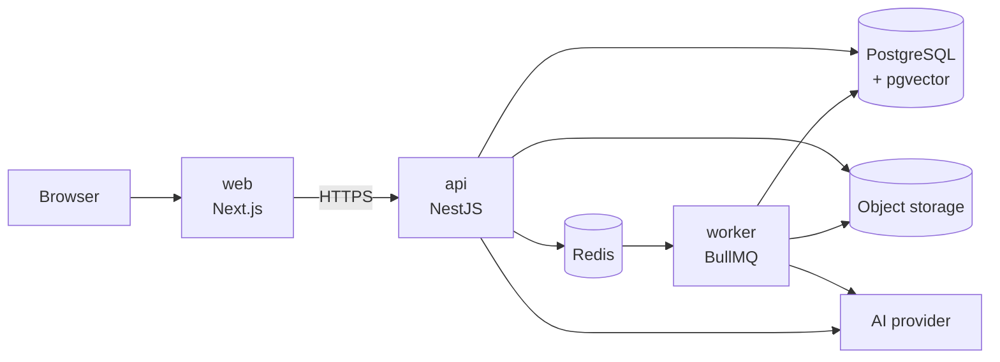
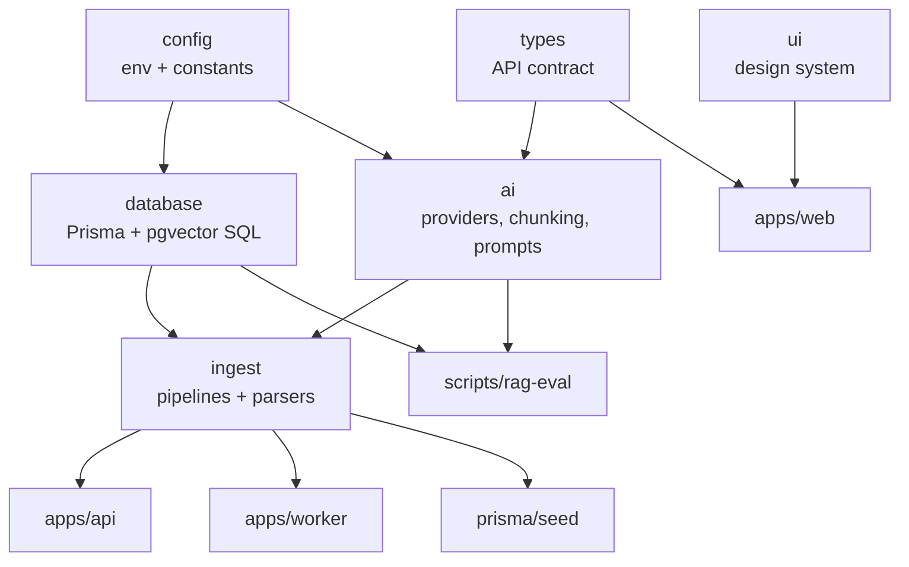

# Architecture

Why the pieces are arranged this way.

## The four processes

**The API never does expensive work inside a request.** Uploading a document
stores the bytes, writes a row and enqueues a job; extraction, chunking,
embedding, transcription and summarising all happen in the worker. The one
deliberate exception is parsing a message export or a transcript file, which is
fast and where the uploader needs to be told immediately what was read and what
was skipped — a silent background failure on a malformed export is far worse
than a slightly slower request.

## Package boundaries

Three boundaries carry their weight:

**`packages/ai` isolates the provider.** Nothing above it knows whether answers
come from a model or from extraction. That is what makes the whole product
runnable and testable with no API key, and what makes swapping providers a
one-file change.

**`packages/ingest` is framework-free** and holds the pipelines. The API, the
worker, the seed and the evaluation script all run the *same* ingestion code.
Without it the pipeline would be duplicated between the API and the worker, and
the two copies would drift — the seed would index content differently from the
worker, and the evaluation would measure something other than production.

**`packages/types` is the API contract**, shared by server and browser. A change
to a response shape fails the type check on both sides in the same commit.

## Why one database

Vectors, full-text search and relational data all live in PostgreSQL. A
dedicated vector database would mean two stores to keep in sync, two things to
back up, and a distributed transaction problem every time a document is deleted.
pgvector with an HNSW index is more than adequate at community scale, and being
able to join a vector search directly against `sources`, `documents` and
`meetings` in one query is what makes citations cheap and correct.

## The Source table

Every citable thing — a document, a meeting, a message, an announcement — owns
exactly one row in `sources`. Retrieval always resolves to a `Source`, and a
citation points at one.

This matters for two reasons. A citation never points at a raw table id, so the
frontend renders one kind of card no matter what was cited. And `Source` is
where per-source access control will attach: it already carries the type, the
author, the date and a metadata bag, so filtering retrieval by group membership
later does not require re-modelling anything.

## Processing status as a claim

Documents and meetings carry a `ProcessingStatus`. It drives the UI, but it is
also the concurrency control: a processor claims a row by moving it to
`PROCESSING` with a conditional update, and a second processor that loses the
race steps aside instead of deleting the first one's chunks halfway through. A
claim older than fifteen minutes is reclaimable, so a crashed worker cannot
block an item forever.

This was not designed up front — it was added after the end-to-end suite raced a
running worker and hit a unique-constraint violation on
`(documentId, chunkIndex)`.

## Error handling

One exception filter turns everything thrown into one envelope with a stable
`code`, a message written for a person, optional field-level `details`, and the
request id. Deliberate failures (`AppException`) carry their own code and
message; anything unexpected becomes a generic 500 whose detail goes only to the
log, with the request id linking the two.

## Observability

Structured JSON logs with a request id propagated through async work by
`AsyncLocalStorage` and returned as `X-Request-Id`. Retrieval and generation
timings are recorded per answer and returned in the chat response, which is why
the UI can show "how this was answered" — the same numbers an operator would
want are the ones a reader gets to see.

## What was deliberately left out

- **Streaming answers.** Retrieval and citation resolution dominate the
  perceived latency, and streaming complicates the guarantee that citations are
  resolved against what was retrieved. The non-streaming path is honest and
  simple; streaming is on the roadmap.
- **A separate embedding queue per content type.** One queue per pipeline is
  enough at this scale, and fewer queues means fewer ways to get stuck.
- **A caching layer.** Retrieval is 10–30 ms against a seeded corpus. Caching
  answers before that is a problem would risk serving a stale answer after a
  correction is posted — precisely the failure this product exists to prevent.
